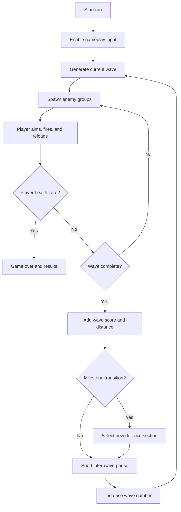
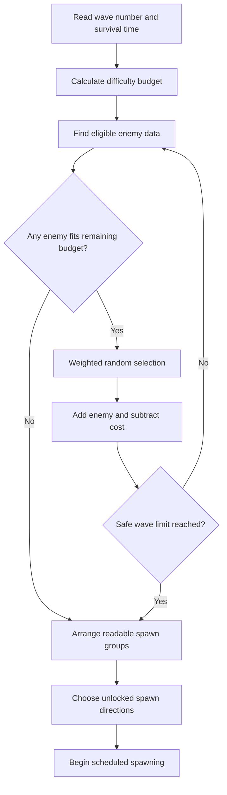
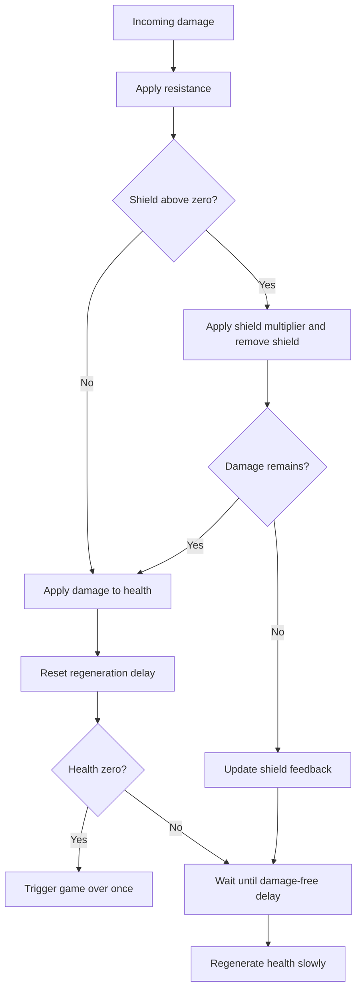
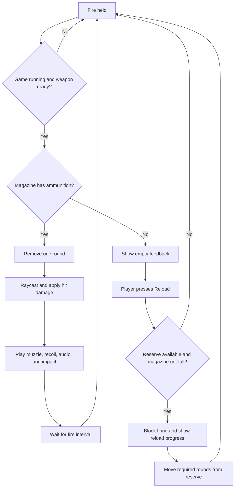
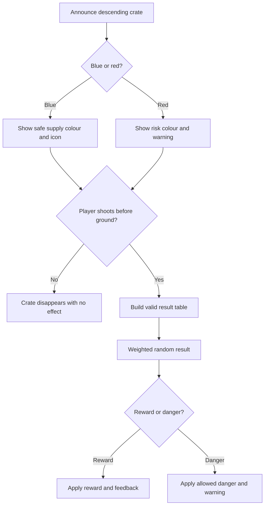
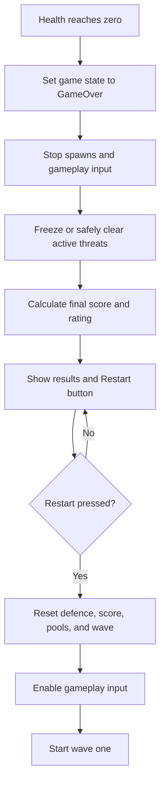

# VALLEY SENTINEL

## Game Design Document

**VGP202 Mobile Game Development - Assignment 1**  
**Student:** Mohammad Faiaz Alikhail  
**Engine:** Unity  
**Platform:** Android - Mobile Devices  
**Document version:** 1.0  
**Date:** July 21, 2026  


---

# 1. Cover Page

**Project title:** Valley Sentinel  
**Camera:** First-person/fixed defensive-gunner view  
**Primary platform:** Android mobile  
**Developer label:** AFCAN Studios  

# 2. Document Control

| Field | Value |
|---|---|
| Version | 1.0 |
| Status | Design and implementation plan |
| Author | Mohammad Faiaz Alikhail |
| Last updated | July 21, 2026 |
| Scope | Assignment GDD plus first playable plan |

## Status language used in this document

- **Configured:** present in the Unity project setup.
- **MVP:** required for the first playable prototype.
- **Planned:** designed but not yet implemented.
- **Future:** outside the Assignment 1 prototype.

At the time of writing, the project setup and documents are prepared. The gameplay systems described below are plans, not claims of finished work.

# 3. Game Overview

Valley Sentinel is a single-player, offline, low-poly 3D mobile game. The player operates a defensive machine gun from a fixed high-ground position above a stylized mountain valley. Enemy units enter from distant roads, paths, ridges, and later air routes. The player aims, fires, reloads, collects selected supply crates, and tries to survive for as long as possible.

The run has no final wave. A procedural budget creates an unlimited sequence of numbered waves. Enemy composition, pressure, attack directions, equipment, and timing become harder. The visible frontline distance and defence score continue to increase until the player's health reaches zero.

## One-sentence description

Use a right-side aiming stick and left-side weapon controls to defend a mountain position through an endless, procedurally escalating battlefield.

# 4. High Concept

The game combines the readable score-and-distance structure of an infinite runner with the aiming and survival decisions of a fixed defensive gun game. The player does not run through a track. Instead, the run is represented by continuous frontline progress, new valley sections, automatic defence-stage changes, and endless pressure moving toward a stationary defensive position.

The design focuses on short mobile sessions, clear controls, visible damage feedback, and a simple early prototype. Stronger weapons, aircraft, vehicles, drones, and risk crates are planned so the architecture can grow, but they are not required for the first playable build.

# 5. Assignment Compliance

| Assignment requirement | Design response |
|---|---|
| Infinite runner for mobile | Endless defence-runner with continuous score, distance, numbered stages, and no final wave |
| Mobile controls and gestures | Right virtual joystick for aim; left Fire, Reload, Switch, and Special buttons; no movement stick |
| Graphical asset plan | Detailed categories, source research, licence, cost, style, and mobile notes |
| Detailed GDD | Forty-four sections covering design, technical plan, classes, pseudocode, and flowcharts |
| Core systems | Waves, weapons, defence, enemies, supplies, score, UI, audio, and game state |
| Player mechanics | Stationary turret aim, firing, manual reload, shield, health, and regeneration |
| Weapons and items | Four platform weapons, five special actions, blue and red supply crates |
| Environment | Low-poly mountain valley, roads, paths, ridges, defence structures, and spawn zones |
| Gameplay modes | Main endless run, tutorial/onboarding plan, and future challenge variants |
| Implementation plans | Modular Unity architecture, ScriptableObjects, pooling, performance plan, and phases |
| Pseudocode | Ten required algorithms |
| Flowcharts | Six Mermaid flowcharts |
| Unity classes/objects | Responsibilities, relationships, data, and scene hierarchy |

# 6. Genre and Platform

## Genre

- Primary: infinite runner.
- Structure: endless defence-runner hybrid.
- Secondary: fixed-gunner action and survival.
- Perspective: first-person or fixed gunner camera.

## Platform and technology

- Unity 6.3 LTS, version 6000.3.9f1.
- Universal Render Pipeline.
- C# gameplay code in later stages.
- Android first, landscape orientation.
- Samsung Galaxy A26 5G as the target test device.
- Unity New Input System and On-Screen Controls.
- Single-player and fully offline.
- 60 FPS target.

# 7. Target Audience

The target audience is mobile players who like short action sessions, high-score improvement, and simple controls with gradually increasing pressure. The expected age range is teen and older because the theme includes stylized combat. The presentation avoids gore, real factions, political messages, and real military logos.

Sessions should be understandable within one minute. A new player only needs to learn aim, fire, reload, shield, health, and supply crates. Experienced players improve through target priority, ammunition control, accuracy, combo maintenance, and risk decisions.

# 8. Core Player Experience

The intended experience is controlled pressure. The player can see enemies far down the valley, choose targets, and feel the situation become harder without losing control of the camera. Successful play should create the following rhythm:

1. Scan the valley and identify the closest or most dangerous target.
2. Aim with the right thumb while firing or reloading with the left thumb.
3. Watch ammunition, shield, and health while the current wave advances.
4. Choose whether a supply crate is worth shooting.
5. Finish a wave, receive a short breathing period, and continue farther.
6. Reach stronger mixed formations and try to beat the previous score and distance.

The player should feel that the position is holding against an advancing frontline. Failure should be understandable: too much incoming damage, a missed reload window, poor target priority, or a risky crate result.

# 9. Infinite Runner Structure

## Why Valley Sentinel qualifies as an infinite runner

Valley Sentinel keeps the defining structure of an infinite runner even though the player character does not physically run. The player's **run** is one uninterrupted attempt that continues until death. During that attempt:

- Procedural waves continue without a fixed ending.
- The wave number, survival time, score, and frontline distance rise continuously.
- New valley sections and spawn zones become active as progress increases.
- The battlefield visually advances toward the defensive position.
- Numbered defence stages advance automatically; there is no level-select stop between waves.
- Difficulty increases through enemy number, speed, attack timing, health, armour, accuracy, damage, weapon type, attack direction, and support units.
- Every 20 waves can relocate the defensive platform to another procedurally selected mountain or valley position.
- There is no final wave, final boss, or victory screen.
- The only normal end condition is the player reaching zero health.

Therefore, movement through the infinite course is expressed by battlefield and frontline progression rather than by moving a character forward. It is not a vehicle runner and the player never leaves the defensive gun position.

## Progress model

```text
frontlineProgress = survivalSeconds * baseProgressRate
                  + completedWaves * waveProgressBonus
                  + majorAssaultsCompleted * milestoneBonus
```

The displayed distance is a game metric, not a claim that the turret physically travelled every metre. At transition milestones, the game may use a short fade and establish a new high-ground position so the visual world catches up with the progress value.

# 10. Core Gameplay Loop

## Moment-to-moment loop

Aim -> select target -> fire -> manage recoil/heat -> reload -> avoid damage by removing threats -> collect a useful crate -> repeat.

## Wave loop

Generate budget -> select eligible enemies -> spawn formation -> player defends -> resolve kills and supplies -> complete wave -> increase score/distance -> apply milestone -> generate next wave.

## Run loop

Start run -> learn/confirm controls -> survive waves -> earn a defence rating -> die -> review results -> restart and improve.

# 11. Mobile Controls

## Landscape control layout

| Screen area | Control | Function |
|---|---|---|
| Right lower area | Virtual joystick | Rotate turret yaw and weapon pitch; move camera aim |
| Left lower area | Fire | Hold to fire while ammunition and fire timer allow |
| Left middle area | Reload | Start manual reload if magazine is not full and reserve ammo exists |
| Left upper area | Switch Weapon | Cycle supported platform weapon; future, hidden in MVP |
| Left upper area | Special Weapon | Use charged special action; future, hidden in MVP |
| Top corner | Pause | Pause game and show resume/settings/quit options |
| Pause/settings | Sensitivity | Adjust aim response |

There is no movement joystick. Tapping an enemy does not snap the aim to that target. The right joystick controls horizontal rotation and vertical pitch directly. This preserves player skill and avoids a tap-to-target reticle system.

## Control behaviour

- Aim input is a `Vector2` from -1 to 1.
- Horizontal input rotates the turret yaw.
- Vertical input rotates weapon pitch and camera; vertical range is clamped.
- Sensitivity scales degrees per second, not total angle per frame.
- Releasing the stick returns input to zero, but the gun stays at its current angle.
- Fire supports holding the button.
- Reload is manual. An empty magazine may show a prompt but does not silently refill.
- Controls respect screen safe areas and remain large enough for thumb use.

## Accessibility and future options

- Aim sensitivity slider.
- Invert vertical aim toggle.
- Left/right control-size options if time permits.
- Optional vibration for shield break, empty magazine, and heavy hits.
- Optional gyroscope aim assist in a future version.

Gyroscope input is not required for the first prototype.

# 12. Player Mechanics

The player controls a stationary weapon platform. The player cannot walk, dodge, crouch, or move to another point manually.

## Turret aiming

- Separate transforms for horizontal yaw and vertical pitch.
- Horizontal limit can be full rotation or a level-specific arc. The prototype should begin with a readable forward arc, such as -75 to +75 degrees.
- Vertical pitch should support valley-floor targets and limited air targets, such as -15 to +55 degrees.
- Aim moves at a constant speed scaled by joystick magnitude and sensitivity.

## Target priority decisions

The player chooses between:

- Nearby infantry causing immediate damage.
- RPG or sniper units that cause high damage.
- Vehicles with higher score and armour.
- Air targets requiring the anti-air weapon.
- Supply crates that disappear if ignored.

Only basic infantry and a blue crate are needed for the MVP, but the targeting decision is kept in the full design.

## Player progression during a run

Supplies and wave rewards may improve damage, reload speed, fire rate, ammunition capacity, maximum shield, maximum health, and special charges. The first prototype needs only a simple direct blue-crate reward. A permanent upgrade tree is future scope.

# 13. Shield and Health System

The defence has two survival values.

## Shield

- Receives most incoming damage before health.
- Does not instantly regenerate.
- Restored through blue supplies, rare red results, or later upgrades.
- Uses visible bar changes, hit flashes, sparks, and sound.
- Low shield may add cracks or a warning colour.
- Shield break has a strong one-time effect without blocking the screen.

## Health

- Receives remaining damage after the shield is depleted.
- Slowly regenerates after no damage is received for a short delay.
- Stops regenerating at maximum health.
- Reaching zero ends the run.

## Planned variables

| Variable | Meaning |
|---|---|
| maximumShield | Upper shield capacity |
| currentShield | Current shield points |
| maximumHealth | Upper health capacity |
| currentHealth | Current health points |
| shieldDamageMultiplier | Adjusts damage applied to shield |
| healthRegenerationDelay | Safe time required before regeneration |
| healthRegenerationRate | Health restored per second |
| incomingDamageResistance | Percentage reduction before shield/health calculation |

## Damage order

1. Clamp raw damage to a valid positive value.
2. Apply resistance.
3. Multiply shield portion by the shield damage multiplier.
4. Remove as much shield as possible.
5. Pass remaining damage to health.
6. Record the damage time and stop regeneration.
7. If health is zero, trigger game over once.

# 14. Weapons

One defensive platform supports several weapon types. Only the Standard Machine Gun is an MVP implementation target.

| Weapon | Role | Strength | Weakness | Prototype status |
|---|---|---|---|---|
| Standard Machine Gun | General purpose | Reliable, medium damage and fire rate | Limited against heavy armour | MVP |
| Heavy Machine Gun | Anti-armour | Higher calibre and damage | Lower fire rate, heavier recoil | Planned |
| Anti-Air Rapid-Fire Cannon | Air defence | Very high fire rate and tracking pressure | High ammunition use | Planned |
| Explosive Launcher | Groups/vehicles | Area damage | Slow reload, limited ammunition | Optional future |

## Common weapon data

- Magazine size.
- Reserve ammunition.
- Damage.
- Fire rate.
- Reload duration.
- Projectile speed or raycast mode.
- Accuracy/spread.
- Heat or recoil.
- Target effectiveness category.
- Muzzle flash, sound, hit effect, and layer mask references.

## First weapon approach

The Standard Machine Gun should use a raycast for the first prototype. It is cheaper than many fast physical bullets, easier to aim, and easier to test. A visible tracer can be cosmetic and pooled. Damage still uses a weapon data asset so a projectile weapon can be added later.

# 15. Ammunition and Reloading

The magazine and reserve are separate. Firing removes one round from the magazine. Reloading moves only the required number of rounds from reserve to magazine.

Rules:

- The player reloads manually.
- Reload does not begin if the magazine is full, reserve is empty, or a reload is already active.
- Firing is blocked during reload.
- The HUD shows `magazine / reserve` and a reload indicator.
- Empty fire input plays a limited click sound and gives a visual prompt.
- Heavy and anti-air weapons consume ammunition faster.
- A weapon upgrade can change magazine capacity, but it must not create ammunition by accident.

Example Standard Machine Gun starting values for testing, subject to balancing:

| Setting | Prototype starting value |
|---|---:|
| Damage | 20 |
| Fire rate | 8 shots/second |
| Magazine | 40 rounds |
| Reserve | 160 rounds |
| Reload duration | 2.2 seconds |
| Base spread | 1.0 degree |
| Effectiveness | Infantry and light targets |

# 16. Special Weapons

Special weapons are limited-use actions earned from supplies, milestones, or upgrades. They are part of the future architecture and are not implemented in the first prototype.

| Special action | Intended effect | Balance limit |
|---|---|---|
| Cruise Missile Strike | High damage to one marked heavy target or small area | Rare charge and warning delay |
| Airstrike | Line or zone damage across the valley | Cannot be used continuously |
| Combat Drone | Temporary offensive support | Fixed duration and limited target rate |
| Defensive Drone | Shoots nearby threats or intercepts some attacks | Low damage and short duration |
| Emergency Supply Request | Forces an earlier blue crate opportunity | Long cooldown or one charge |

The player activates a special through the left-side Special Weapon button. If several specials are later available, weapon switching or a small radial menu may select the active charge. The MVP hides this button to avoid showing a control that does nothing.

# 17. Supply-Drop System

Supply aircraft periodically cross a distant route and release parachute crates. The crate descends through a visible drop zone. The player must shoot it before it reaches the ground. A successful hit opens the crate and immediately or briefly displays its result.

## Timing and readability

- The first blue crate appears after the player understands firing and reloading.
- A radio call, aircraft sound, parachute colour, and HUD message announce the drop.
- The crate moves slowly enough to be a deliberate target but fast enough to interrupt target priority.
- If the crate reaches the ground, it disappears or becomes unavailable; the player does not walk to collect it.
- Crate timing pauses or adjusts during game over and major transitions.

## Prototype version

The MVP uses only one blue crate with one simple reward table. It may descend on a straight path with no aircraft model. Red crates and complex aircraft are future work.

# 18. Blue and Red Crates

## Blue Supply Crate

Possible rewards:

- Ammunition refill.
- Shield restoration.
- Small health support.
- Damage upgrade.
- Reload-speed upgrade.
- Fire-rate upgrade.
- Weapon upgrade.
- Temporary defensive drone.
- Special weapon charge.

For the first prototype, use three clear outcomes: ammunition, shield restoration, or small health support. Direct rewards are easier to test than timed upgrades.

## Red Risk Crate

The red crate creates a meaningful choice: shoot it and accept a controlled random result, or ignore it and let it disappear. It must include both rewards and dangers.

Example controlled table:

| Result | Type | Example weight |
|---|---|---:|
| Temporary heavy weapon | Reward | 12 |
| Rare damage upgrade | Reward | 10 |
| Large ammunition refill | Reward | 16 |
| Airstrike charge | Reward | 8 |
| Heavy shield refill | Reward | 14 |
| Heavy tank reinforcement | Danger | 8 |
| Infantry reinforcement group | Danger | 12 |
| Ammunition drain | Danger | 6 |
| Short weapon malfunction | Danger | 5 |
| Increased enemy aggression | Danger | 5 |
| Drone swarm | Danger | 4 |
| Stronger next wave | Danger | 10 |

Weights are examples and must be playtested. The table should prevent impossible outcomes in early waves. A heavy tank result cannot be selected before the tank enemy is unlocked and implemented. Consecutive severe dangers may be limited so the choice stays risky rather than unfair.

# 19. Enemies

All enemies use a shared `EnemyBase` runtime structure and an `EnemyData` ScriptableObject. Only Basic Infantry is an MVP requirement.

## Shared enemy data

- Maximum health.
- Damage.
- Movement speed.
- Attack range.
- Attack delay.
- Accuracy.
- Score value.
- Armour type.
- Target priority.
- Wave cost.
- Minimum wave.
- Selection weight.

## Ground enemy plan

| Enemy | Main behaviour | Wave cost example | Earliest use |
|---|---|---:|---:|
| Basic Infantry | Advances to an attack point and fires slowly | 1 | 1 |
| Rifle Infantry | More accurate basic attacker | 2 | 3 |
| Machine-Gun Soldier | Sustained pressure, exposed while firing | 3 | 5 |
| RPG Soldier | Slow high-damage projectile; high priority | 3 | 5 |
| Sniper | Uses distant hidden position and high warning damage | 4 | 7 |
| Armoured Soldier | Resists standard fire until armour breaks | 4 | 8 |
| Drone Operator | Supports or spawns scout drones | 5 | 12 |

## Basic Infantry MVP

The first enemy needs only these states: pooled/inactive, advancing, at attack position, attacking, dead, returned to pool. It can move toward a waypoint or target transform and fire on a timer. No cover search, squad tactics, path prediction, or advanced decision tree is required.

# 20. Vehicles

Vehicles are planned for later progression and are not in the first prototype.

| Vehicle | Role | Armour | Wave cost example |
|---|---|---|---:|
| Motorcycle Attacker | Fast, fragile flanking target | Light | 3 |
| Technical Vehicle | Mobile gun platform | Light | 5 |
| Armoured Personnel Carrier | Delivers infantry and absorbs fire | Medium | 8 |
| Light Tank | Direct-fire pressure | Medium/Heavy | 12 |
| Heavy Tank | Slow high-health major threat | Heavy | 20 |
| Missile Vehicle | Long-range high-priority support | Medium | 15 |

Vehicles follow simple authored road splines or waypoints. Full vehicle physics is excluded. Wheels may be visual only. Damage zones and armour categories matter more than realistic suspension.

# 21. Air Enemies

Air enemies enter through fixed sky routes so aiming remains readable on a small screen.

| Air enemy | Role | Wave cost example |
|---|---|---:|
| Scout Drone | Marks or distracts; low health | 5 |
| Attack Drone | Small, fast, repeated damage | 7 |
| Helicopter | Sustained fire and lateral movement | 12 |
| Transport Helicopter | Delivers a ground group | 14 |
| Low-Flying Jet | Fast pass and short attack window | 16 |
| Close-Air-Support Aircraft | Heavy milestone attack | 20 |

The anti-air rapid-fire cannon is the intended counter. Air units must provide approach audio, direction warnings, and clear silhouettes. Jets, helicopters, and advanced drones are future scope.

# 22. Infinite Wave System

The system must create waves without a final number. It uses a difficulty budget instead of a fixed list.

## Budget formula

```text
WaveBudget = BaseBudget
           + WaveNumber * DifficultyGrowth
           + TimeSurvived * TimeMultiplier
```

Each eligible enemy has a wave cost. The WaveManager spends the budget on weighted random choices that fit the remaining amount. A low-cost infantry entry always remains eligible so the algorithm can finish spending or stop cleanly.

## Example costs

| Enemy | Cost |
|---|---:|
| Infantry | 1 |
| RPG Soldier | 3 |
| Sniper | 4 |
| Scout Drone | 5 |
| Armoured Vehicle | 8 |
| Helicopter | 12 |
| Heavy Tank | 20 |

## Wave stages

1. Calculate budget and current difficulty modifiers.
2. Build a list of enemies whose minimum wave has been reached and cost fits.
3. Select enemies until the budget cannot buy another valid entry.
4. Divide the list into readable spawn groups.
5. Choose available ground/air directions.
6. Spawn through pools with a scaled delay.
7. Wait until scheduled groups are spawned and active enemies are defeated.
8. Award wave progress and schedule the next wave.

The algorithm is technically unlimited. In practice, values such as simultaneous active enemies, minimum spawn delay, and stat multipliers are clamped to device-safe maximums. Difficulty can continue by changing composition, elite chance, direction, and pressure even when a performance limit is reached.

# 23. Difficulty Progression

Difficulty does not increase only by adding health.

## Scaling variables

- Larger budgets and more total enemies.
- Faster spawn groups, with a safe minimum delay.
- New enemy types and combined ground/air groups.
- More attack directions and fewer quiet angles.
- Small health and damage multipliers.
- Improved enemy accuracy, capped to leave counterplay.
- Increased armour and support units.
- Reduced rest time between waves.
- More dangerous target-priority combinations.
- Stronger red-crate danger table at later stages.

## Milestones

| Milestone | Change |
|---|---|
| Every 5 waves | Stronger mixed formation and a clear warning |
| Every 10 waves | Major assault with a larger budget and higher-value enemies |
| Every 20 waves | Environment/defence-position transition and new spawn layout |
| Later waves | Advanced drones, armour, support units, and coordinated attack directions |

## Fairness rules

- New threats appear alone or in small numbers before being mixed heavily.
- High-damage attacks use warnings and travel time where possible.
- Accuracy, spawn delay, and incoming damage have practical caps.
- The player receives short breaks for reload and information reading.
- Major transitions do not begin while a crate result or game-over sequence is unresolved.

# 24. Scoring and Defence Rating

The HUD displays current wave, enemies defeated, defence score, frontline distance, survival time, multiplier, shield, health, and ammunition.

## Enemy score

```text
EnemyScore = EnemyBaseValue
           * WaveMultiplier
           * AccuracyBonus
           * ComboMultiplier
```

The first prototype may simplify this to base score times a wave multiplier, then add accuracy and combo when hit tracking is reliable.

## Total defence score represents

- Enemies defeated.
- Waves completed.
- Strategic value of destroyed vehicles and support enemies.
- Supply crates collected.
- Damage avoided or shield remaining at milestones.
- Accuracy.
- Survival time.

## Combo rules

The combo multiplier increases with consecutive kills inside a time window and resets after a long gap, player damage, or another clear rule selected during testing. The rule must be visible and not punish the player during mandatory quiet gaps between waves.

## Defence ratings

| Rating | Example score threshold |
|---|---:|
| Recruit | 0 |
| Defender | 2,500 |
| Guardian | 10,000 |
| Sentinel | 25,000 |
| Valley Shield | 60,000 |
| Legendary Defender | 120,000 |

Thresholds are placeholders for playtesting. The names are fictional performance labels, not real military ranks.

# 25. Environment

The main setting is a fictional stylized mountain valley inspired by the broad forms and steep terrain of Afghan mountain geography, including areas similar in shape to Panjshir Valley. It does not recreate a real battle, real village, real unit, or political conflict.

## Required environmental elements

- High defensive platform.
- Valley floor and dry river/road shape.
- Vehicle road and mountain footpaths.
- Distant fictional village silhouettes.
- Rock formations and mountain walls.
- Sandbags, barriers, and a watchtower.
- Multiple ground spawn zones.
- Future sky routes and sniper ridges.
- Visible parachute drop zone.

## Procedural progress presentation

The MVP can use one authored valley section. Later, a library of low-cost sections can activate in front of the player or be selected at 20-wave transitions. Each section defines spawn zones, road paths, scenery groups, sky routes, lighting palette, and defensive-platform anchor. This gives visual forward progress without moving the player during combat.

# 26. User Interface

## HUD information

- Top left: current wave and milestone warning.
- Top centre: defence score, multiplier, and frontline distance.
- Top right: pause.
- Lower centre or weapon area: magazine, reserve, and reload status.
- Lower edge: shield bar above health bar with numeric values if readable.
- Small results feed: enemy score, crate reward, or risk result.
- Left controls: Fire and Reload; future Switch and Special.
- Right control: virtual aiming joystick.

## UI rules

- Use safe-area anchors for notches and rounded screens.
- Use blue for friendly supply/shield, red/orange for danger, and neutral light text for information.
- Never rely on colour alone; add icons, labels, or bar shapes.
- Buttons require clear pressed feedback.
- Avoid placing important enemy targets behind opaque controls.
- Use short messages because the player is aiming during play.

## Screens and panels

- Main menu: Play, Settings, Credits, Quit/Back where appropriate.
- Pause: Resume, Sensitivity, Audio, Restart confirmation, Main Menu.
- Game over: score, wave, distance, kills, survival time, defence rating, Restart.

# 27. Audio and Feedback

Audio supports information more than realism.

## Required audio categories

- Machine-gun shot and mechanical loop/tail.
- Reload start, magazine action, and reload complete.
- Empty magazine click with rate limiting.
- Bullet impact by simple surface category.
- Enemy shot and hit confirmation.
- Shield hit, low-shield warning, and shield break.
- Health hit and low-health warning.
- Supply aircraft/drop cue and crate reward.
- Wind ambience for the valley.
- UI press, pause, score, and game-over sounds.

## Feedback combinations

| Event | Visual | Audio | Optional haptic |
|---|---|---|---|
| Weapon fires | Muzzle flash, recoil, tracer | Shot | Light pulse, optional |
| Enemy hit | Small hit marker/impact | Hit tick | None |
| Shield hit | Blue flash/sparks/bar change | Shield impact | Short pulse |
| Shield breaks | Crack effect and warning | Break cue | Strong pulse |
| Reload | Progress indicator | Mechanical sequence | Completion pulse |
| Crate reward | Colour/icon and text | Reward cue | Medium pulse |
| Game over | HUD fade and results | Failure sting | One strong pulse |

Gun sounds must be limited and mixed so rapid fire does not create clipping or too many AudioSources.

# 28. Visual Style

- Low-poly 3D with simple shapes and a small colour palette.
- Slightly cartoonish proportions and readable silhouettes.
- Warm tan and grey mountains, muted structures, and a blue sky.
- Enemies use strong value contrast against the ground.
- Blue identifies normal supplies and shield energy.
- Red identifies risk crates, urgent damage, and hazards.
- No gore or realistic injury detail.
- No real flags, insignia, uniforms, slogans, or logos.
- Texture atlases and shared materials where practical.

The preferred asset strategy is one main themed pack plus a small number of CC0 support assets. If sources use different styles, materials and colours should be adjusted to a shared palette before mixing them.

# 29. Asset Plan

The detailed researched table is in `ASSET_RESEARCH.md`. No assets are downloaded automatically.

## Graphical asset list

| Category | MVP | Future | Production notes |
|---|---|---|---|
| Mountain valley | One low-poly environment | Multiple section variants | Build with low-poly meshes and shared material palette |
| Defensive position | Platform, barriers, sandbags | Watchtowers and alternate positions | Simple colliders |
| Turret weapon | Standard machine gun | Heavy MG, AA cannon, launcher | Separate yaw/pitch parts |
| Infantry | One rigged basic enemy | Six ground variants | One skeleton and shared controller preferred |
| Vehicles | None | Motorcycle, technical, APC, tanks, missile vehicle | Follow paths; no full physics |
| Aircraft | None | Drones, helicopters, jets | Fixed routes and simple LODs |
| Supplies | One blue crate and parachute | Red crate and aircraft | Strong colour coding |
| VFX | Muzzle flash, one impact, shield flash | Explosions, smoke, airstrike | Pool all repeated effects |
| UI | Aim stick, buttons, bars, icons | Upgrade and special icons | Consistent icon weight |
| Animation | Walk, attack, hit, death | Vehicle crews and operators | Mixamo or pack animations after licence check |

## Audio asset list

Gun shots, reload, impacts, explosions, helicopter/aircraft, wind, warning, shield hit/break, UI buttons, score feedback, and game-over cue are required categories. MVP needs only machine gun, reload, infantry shot, shield hit, UI, and ambience.

## Researched source shortlist

Research was checked on July 21, 2026. Prices and store listings may change, so the licence must be checked again on the download date.

| Source/asset | Licence | Cost found | Planned use | Mobile/style note |
|---|---|---:|---|---|
| Kenney Nature Kit and Mobile Controls | CC0 | Free/donation | Rocks, vegetation, joystick, button art | Consistent simple low-poly/UI style; import only needed files |
| Quaternius Ultimate Stylized Nature | CC0 | Free core download | Mountain scenery, rocks, plants | 60+ stylized models; good palette match |
| Unity Asset Store: Military Assets (Mobile) | Standard Unity Asset Store EULA | Free | Small military prop/placeholder set | Listing describes mobile optimization and URP compatibility with minor material work |
| Unity Asset Store: Low Poly Military Characters | Standard Unity Asset Store EULA | USD 15.99 | Rigged infantry variants | Listing describes mobile-friendly humanoid characters and low polygon counts |
| Unity Asset Store: Military Forest pack | Standard EULA, Single Entity | USD 89 | Optional one-pack environment/vehicle route | 428 low-poly assets and Unity 6/URP compatibility; too expensive for MVP unless reused heavily |
| Adobe Mixamo | Adobe Mixamo terms | Free with Adobe ID | Humanoid walk, attack, hit, and death animations | Use one compressed humanoid rig for the MVP |
| Poly Pizza / Sketchfab | Per-model CC0, CC BY, or store licence | Varies | One missing specialist model only | Prefer CC0; record author/source; reject Editorial or unclear licences |
| OpenGameArt | Per-asset licence | Usually free | Selected audio/VFX placeholders | Assume attribution unless the asset is clearly CC0 |

Detailed links, attribution rules, and category coverage are recorded in `ASSET_RESEARCH.md`. No recommended asset has been downloaded or imported. The project will prefer CC0 individual assets, keep every licence record, provide CC BY credit when required, and reject Non-Commercial, Editorial, No-Derivatives, or unclear material.

# 30. Unity Technical Architecture

The project uses focused runtime classes and data assets.

```text
Input actions -> InputReader -> Turret / Weapon / Pause
WeaponData -> WeaponController -> IDamageable targets
EnemyData -> WaveManager -> EnemySpawner -> EnemyBase pool
EnemyBase -> PlayerDefence -> GameManager game over
Enemies/Waves/Crates -> ScoreManager -> UIManager
All feedback requests -> AudioManager / pooled VFX
```

## Technical choices

- ScriptableObjects for weapon and enemy variants.
- Raycast Standard Machine Gun for the MVP.
- Object pooling for enemies, impacts, effects, and crates.
- Explicit references and events instead of gameplay-time scene searches.
- Mobile URP with post-processing disabled for the prototype.
- Simple colliders and waypoint movement.
- Event-driven HUD updates instead of rebuilding all text each frame.

# 31. Unity Classes and Objects

## Class responsibilities

| Class | Responsibility |
|---|---|
| GameManager | Game state, run start/end/restart, pause, survival time |
| InputReader | New Input System callbacks and aim/fire/reload/special state |
| PlayerTurretController | Horizontal rotation, vertical pitch, clamps, sensitivity |
| WeaponController | Fire rate, ammunition, reload, hits, muzzle feedback |
| WeaponData | Configurable weapon statistics |
| PlayerDefence | Shield, health, resistance, regeneration, death |
| EnemyBase | Shared health, movement state, attack timing, death |
| EnemyData | Configurable enemy values, score, armour, cost |
| EnemySpawner | Spawn-zone choice and pool requests |
| WaveManager | Endless budgets, selection, spawn scheduling, milestones |
| ObjectPool | Reuse of enemies, impacts, bullets if used, and crates |
| SupplyDropManager | Drop timing, routes, crate type, result request |
| SupplyCrate | Descent, damage, opening, reward/danger trigger |
| ScoreManager | Score, kills, waves, combo, distance, rating |
| UIManager | HUD, pause, game-over, and feedback text |
| AudioManager | Weapon, enemy, shield, ambience, and UI audio playback |

The more detailed data fields, events, states, and object hierarchy are documented in `CLASS_ARCHITECTURE.md`.

# 32. Input System Implementation

The `Gameplay` action map contains Aim, Fire, Reload, SwitchWeapon, SpecialWeapon, and Pause. The `UI` map contains Navigate, Submit, Cancel, Point, and Click.

## On-screen connection

- Right joystick uses `OnScreenStick` with control path `<Gamepad>/rightStick`.
- Fire uses `OnScreenButton` connected to the Fire binding control.
- Reload uses `OnScreenButton` connected to the Reload binding control.
- Future Switch and Special buttons use their own virtual controls.
- The EventSystem uses the Input System UI Input Module.

`InputReader` subscribes to input actions once, raises events, and exposes current aim. Turret and weapon scripts do not call `Input.GetTouch` or inspect screen positions. Editor keyboard/mouse bindings allow testing without a phone.

# 33. Object Pooling

Pooling prevents repeated creation and destruction during long waves.

## Pool candidates

- Basic infantry and all later enemies.
- Bullet impacts and tracers.
- Muzzle flashes if represented by spawned objects.
- Supply crates.
- Explosions and temporary warning markers.

## Reset requirements

When an object leaves the pool, reset health, timers, velocity, target, animation state, damage flags, and visuals. When it returns, cancel pending actions and event subscriptions. A pool may grow carefully when empty, but WaveManager also enforces an active-enemy cap for mobile performance.

# 34. Pseudocode

## 34.1 Infinite wave-budget generation

```text
FUNCTION GenerateWave(waveNumber, survivalSeconds):
    budget = baseBudget
             + waveNumber * difficultyGrowth
             + survivalSeconds * timeMultiplier

    budget = CLAMP(budget, minimumBudget, safeMaximumBudget)
    enemies = empty list

    WHILE budget >= GetMinimumEligibleCost(waveNumber):
        validEnemies = all EnemyData where
            enemy.waveCost <= budget
            AND enemy.minimumWave <= waveNumber
            AND enemy is implemented and enabled

        IF validEnemies is empty:
            BREAK

        selectedEnemy = WeightedRandom(validEnemies)
        ADD selectedEnemy to enemies
        budget = budget - selectedEnemy.waveCost

        IF enemies.count >= safeWaveEnemyLimit:
            BREAK

    RETURN CreateReadableSpawnGroups(enemies, waveNumber)
```

## 34.2 Enemy selection by spawn cost

```text
FUNCTION SelectEnemyForBudget(remainingBudget, waveNumber, allowedRoutes):
    candidates = empty list

    FOR EACH enemyData in enabledEnemyDatabase:
        IF enemyData.minimumWave > waveNumber:
            CONTINUE
        IF enemyData.waveCost > remainingBudget:
            CONTINUE
        IF enemyData required route is not in allowedRoutes:
            CONTINUE
        ADD enemyData to candidates

    IF candidates is empty:
        RETURN null

    totalWeight = SUM candidate.selectionWeight for candidates
    roll = RANDOM value from 0 to totalWeight

    FOR EACH candidate in candidates:
        roll = roll - candidate.selectionWeight
        IF roll <= 0:
            RETURN candidate

    RETURN last candidate
```

## 34.3 Shield and health damage

```text
FUNCTION ApplyIncomingDamage(rawDamage):
    IF game is not Running OR rawDamage <= 0:
        RETURN

    resistance = CLAMP(incomingDamageResistance, 0, maximumResistance)
    remainingDamage = rawDamage * (1 - resistance)
    lastDamageTime = currentTime

    IF currentShield > 0:
        shieldDamage = remainingDamage * shieldDamageMultiplier
        absorbedShieldDamage = MIN(currentShield, shieldDamage)
        currentShield = currentShield - absorbedShieldDamage

        damageFractionNotAbsorbed = 1 - absorbedShieldDamage / shieldDamage
        remainingDamage = remainingDamage * damageFractionNotAbsorbed

        NOTIFY ShieldChanged

        IF currentShield <= 0:
            NOTIFY ShieldBroken once

    IF remainingDamage > 0:
        currentHealth = MAX(0, currentHealth - remainingDamage)
        NOTIFY HealthChanged

    IF currentHealth <= 0:
        NOTIFY DefenceDestroyed once
```

## 34.4 Health regeneration

```text
FUNCTION UpdateHealthRegeneration(deltaTime):
    IF game is not Running:
        RETURN
    IF currentHealth <= 0 OR currentHealth >= maximumHealth:
        RETURN
    IF currentTime - lastDamageTime < healthRegenerationDelay:
        RETURN

    restored = healthRegenerationRate * deltaTime
    currentHealth = MIN(maximumHealth, currentHealth + restored)
    NOTIFY HealthChanged
```

## 34.5 Weapon firing

```text
FUNCTION TryFire():
    IF game is not Running:
        RETURN false
    IF isReloading OR currentTime < nextAllowedShotTime:
        RETURN false

    IF magazineAmmo <= 0:
        PlayEmptyFeedbackWithRateLimit()
        RETURN false

    magazineAmmo = magazineAmmo - 1
    nextAllowedShotTime = currentTime + 1 / weaponData.fireRate

    direction = ApplyAccuracySpread(muzzle.forward, weaponData.accuracySpread)
    hit = PhysicsRaycast(muzzle.position, direction, weaponRange, hitMask)

    IF hit contains IDamageable:
        hit.target.ApplyDamage(weaponData.damage)
        ScoreManager.RecordShotHit(hit.target)

    SpawnOrPlayMuzzleFeedback()
    SpawnPooledImpactIfHit(hit)
    ApplyVisualRecoil()
    ScoreManager.RecordShotFired()
    NOTIFY AmmunitionChanged
    RETURN true
```

## 34.6 Reloading

```text
FUNCTION TryStartReload():
    IF isReloading:
        RETURN false
    IF magazineAmmo >= weaponData.magazineSize:
        RETURN false
    IF reserveAmmo <= 0:
        RETURN false

    isReloading = true
    reloadFinishTime = currentTime + currentReloadDuration
    PlayReloadStartFeedback()
    NOTIFY ReloadStateChanged(true)
    RETURN true

FUNCTION CompleteReload():
    IF NOT isReloading OR currentTime < reloadFinishTime:
        RETURN

    needed = weaponData.magazineSize - magazineAmmo
    transferred = MIN(needed, reserveAmmo)
    magazineAmmo = magazineAmmo + transferred
    reserveAmmo = reserveAmmo - transferred
    isReloading = false

    PlayReloadCompleteFeedback()
    NOTIFY AmmunitionChanged
    NOTIFY ReloadStateChanged(false)
```

## 34.7 Score calculation

```text
FUNCTION AddEnemyScore(enemyData, currentWave):
    waveMultiplier = 1 + currentWave * waveScoreGrowth
    accuracyBonus = LERP(minAccuracyBonus, maxAccuracyBonus, currentAccuracy)
    comboMultiplier = GetCurrentComboMultiplier()

    enemyScore = enemyData.scoreValue
                 * waveMultiplier
                 * accuracyBonus
                 * comboMultiplier

    totalScore = totalScore + ROUND(enemyScore)
    enemiesDefeated = enemiesDefeated + 1
    ExtendComboWindow()
    UpdateDefenceRating(totalScore)
    NOTIFY ScoreChanged
```

## 34.8 Supply-crate random result

```text
FUNCTION ResolveCrate(crateType, currentWave):
    IF crateType is Blue:
        table = blueResults that are implemented and currently useful
    ELSE:
        table = redResults where
            result.minimumWave <= currentWave
            AND required systems are implemented
            AND severeDangerStreakRule allows result

    validResults = table where result.condition is true

    IF validResults is empty:
        RETURN safeFallbackAmmunitionReward

    selectedResult = WeightedRandom(validResults)
    ApplyResult(selectedResult)
    RecordRecentCrateResult(selectedResult)
    ShowResultFeedback(selectedResult)
```

## 34.9 Difficulty progression

```text
FUNCTION GetDifficulty(waveNumber, survivalSeconds):
    difficulty.budget = baseBudget
        + waveNumber * budgetGrowth
        + survivalSeconds * timeGrowth

    difficulty.healthMultiplier = CLAMP(
        1 + waveNumber * smallHealthGrowth,
        1,
        maximumHealthMultiplier)

    difficulty.damageMultiplier = CLAMP(
        1 + waveNumber * smallDamageGrowth,
        1,
        maximumDamageMultiplier)

    difficulty.spawnDelay = MAX(
        minimumSpawnDelay,
        baseSpawnDelay - waveNumber * spawnDelayReduction)

    difficulty.directionCount = GetUnlockedDirectionCount(waveNumber)
    difficulty.allowedEnemyTypes = GetUnlockedEnemies(waveNumber)
    difficulty.mixedFormation = waveNumber MOD 5 equals 0
    difficulty.majorAssault = waveNumber MOD 10 equals 0
    difficulty.environmentTransition = waveNumber MOD 20 equals 0

    RETURN difficulty
```

## 34.10 Object pooling

```text
FUNCTION GetFromPool(prefabKey):
    pool = pools[prefabKey]

    IF pool.available contains an object:
        object = REMOVE first available object
    ELSE IF pool.totalCount < pool.safeMaximum:
        object = CREATE one new object for this pool
        pool.totalCount = pool.totalCount + 1
    ELSE:
        RETURN null

    object.SetActive(true)
    object.OnTakenFromPool()
    ADD object to pool.active
    RETURN object

FUNCTION ReturnToPool(object):
    pool = pools[object.prefabKey]
    object.OnReturnedToPool()
    object.SetActive(false)
    REMOVE object from pool.active
    ADD object to pool.available
```

# 35. Flowcharts

## 35.1 Main game loop



## 35.2 Infinite wave generation



## 35.3 Player damage, shield, and health



## 35.4 Weapon firing and reload



## 35.5 Supply-drop decision



## 35.6 Game over and restart



# 36. Performance Plan

The target is 60 FPS on Samsung Galaxy A26 5G. The prototype will be profiled on the device rather than optimized only in the editor.

## Rendering

- Use the official mobile URP asset.
- Keep post-processing off for the MVP.
- Use one main directional light.
- Limit real-time shadow distance and shadow-casting objects.
- Use baked or mixed lighting for static structures when the environment is final enough to bake.
- Reuse shared materials and texture atlases.
- Use simple low-poly meshes and LODs only where they provide measured value.

## CPU and memory

- Pool enemies, impacts, tracers, and crates.
- Use simple colliders and raycasts.
- Keep enemy movement and attack logic small.
- Avoid repeated `FindObjectOfType` and runtime scene searches.
- Avoid one unnecessary `Update` per visual or UI object.
- Update HUD text only when values change or at a controlled rate for time/distance.
- Cap simultaneous enemies and minimum spawn delay.
- Compress and stream audio appropriately after import.

## Test measurements

Record CPU frame time, GPU frame time, memory, draw calls/batches, active enemy count, and thermal behaviour during at least a ten-minute run. A stable frame pace is more important than adding extra decoration.

# 37. Scope

The complete design supports weapons, vehicles, aircraft, drones, risk crates, and environment transitions. The Assignment 1 production scope is much smaller: project setup, a strong design document, and a practical plan. The first playable scope is one complete vertical slice of the endless loop, not the whole design.

# 38. MVP

The first playable prototype includes:

- One low-poly mountain/valley environment.
- One stationary defensive position.
- One controllable Standard Machine Gun.
- Right virtual joystick aiming.
- Fire and Reload buttons.
- Basic magazine and reserve ammunition.
- One Basic Infantry enemy.
- Enemy spawning, approach, attack position, and shooting.
- Shield and health.
- Delayed health regeneration.
- Defence score and current wave.
- Endless wave generation using a budget.
- Game-over state and Restart button.
- One simple blue supply crate.
- Basic Android development build.

## MVP success test

A player can start the scene on the phone, aim with the right thumb, fire and reload with the left thumb, defeat infantry, take shield and health damage, survive several generated waves, collect a blue crate, reach game over, see a score, and restart without reloading the Unity editor.

# 39. Excluded Features

Not included in the first prototype:

- Jets and close-air-support aircraft.
- Cruise missiles and airstrikes.
- Advanced drones.
- Vehicles and vehicle physics.
- Red risk crates.
- Multiple maps or transitions.
- Full weapon selection.
- Permanent progression and large customization.
- Multiplayer or networking.
- Online leaderboard.
- Complex enemy AI, cover search, or squad tactics.
- Large asset packs and complex animation systems.

These features remain in the GDD so the architecture can allow them later, but they are not promised as completed work.

# 40. Development Plan

| Phase | Main output | Exit condition |
|---|---|---|
| 1. Project setup | URP Android project, folders, scene, documents | Opens cleanly and blank scene builds |
| 2. Mobile input | On-screen stick/buttons and InputReader | Actions respond on phone |
| 3. Turret aiming | Clamped yaw/pitch | Smooth and readable at 60 FPS |
| 4. Weapon firing | Standard MG, ammo, reload, raycast | Fire and reload rules pass tests |
| 5. Enemy prototype | Basic infantry approach and attack | Enemy can damage player and die |
| 6. Shield and health | Damage routing, feedback, regeneration | Game over triggers correctly |
| 7. Infinite waves | Budget, spawning, pooling, milestones counter | No fixed final wave |
| 8. Score and UI | HUD, score, wave, distance, results | Values remain correct after restart |
| 9. Supply drop | One blue crate and direct reward | Reward applies and crate times out |
| 10. Android test | Device profiling and fixes | Stable demonstration build |
| 11. GDD completion | Final proofread, diagrams, evidence | Rubric sections complete |
| 12. Submission preparation | PDF and backed-up project/build | Correct names and files verified |

Detailed checkboxes are in `DEVELOPMENT_CHECKLIST.md`.

# 41. Testing Criteria

## Functional

- Aim changes yaw and pitch but never moves the player.
- Fire rate cannot exceed the weapon data value.
- Ammunition cannot become negative.
- Reload transfers the correct amount and cannot duplicate ammo.
- Shield receives damage first and leftover damage reaches health.
- Health regeneration waits for the full delay and stops at maximum.
- Health reaching zero produces one game-over event.
- The wave manager continues past major milestones and has no final wave.
- Restart resets pooled objects and all run values.
- A blue crate only grants one result and does not apply after timeout.

## Mobile usability

- Right aim stick and left buttons can be used at the same time.
- UI remains inside the Samsung phone safe area.
- Important targets are not hidden by controls.
- Buttons have clear pressed feedback and are large enough for thumbs.
- Orientation remains landscape.

## Performance

- Target 60 FPS during the expected prototype enemy count.
- No repeated allocation spikes from spawning or gun feedback.
- No uncontrolled pool growth during a ten-minute run.
- Audio does not clip during automatic fire.
- The phone does not enter severe thermal slowdown during the class demo period.

The full test matrix is in `TESTING_PLAN.md`.

# 42. Risks and Solutions

| Risk | Impact | Response |
|---|---|---|
| Defence concept is judged not to be an infinite runner | Assignment mismatch | Make endless run, distance, stages, visual progress, no final wave, and milestone transitions explicit in the game and GDD |
| Project scope becomes too large | Incomplete prototype | Keep only one weapon, one enemy, one valley, one blue crate |
| Touch aim feels inaccurate | Poor mobile play | Add sensitivity, dead zone, clamped rotation, and device testing early |
| Too many enemies reduce frame rate | Unstable build | Pool, cap active enemies, simplify AI/shadows, and scale composition instead of only count |
| Mixed asset styles look inconsistent | Weak presentation | Prefer one main pack and recolour support assets to one palette |
| Asset licence is unclear | Submission/legal risk | Record source and licence before import; reject unclear/editorial/non-commercial assets |
| Package or editor upgrade breaks the project | Lost class time | Keep Unity 6000.3.9f1, back up, and avoid last-minute upgrades |
| Android phone is not detected | Cannot demonstrate | Test cable/USB debugging early and keep a known-good APK backup |
| Direct project setting edits are wrong | Build problem | Confirm settings in Unity inspector after first import and make a blank Android build |
| Infinite math grows beyond device limits | Crash or unfair waves | Clamp active count, spawn delay, multipliers, and numeric ranges while allowing logical wave numbers to continue |

# 43. Future Features

After the MVP is stable, possible additions are:

- Heavy machine gun, anti-air cannon, and explosive launcher.
- Vehicle and aircraft enemy families.
- Red risk crate with controlled result table.
- Combat and defensive drones.
- Environment transitions every 20 waves.
- More mountain section layouts and weather palettes.
- Temporary weapon upgrades and special charges.
- Optional gyroscope aiming and vibration.
- Local high-score history stored offline.
- Challenge modifiers such as limited ammunition or drone-heavy runs.

Multiplayer and online services are not planned.

# 44. Conclusion

Valley Sentinel is designed as a realistic student project with a small first playable target. Its infinite-runner requirement is satisfied through one continuous run, endless procedural waves, continuous distance and score, automatic stage progress, advancing battlefield sections, and no final level. The stationary gunner control scheme is suited to a landscape phone because the right thumb aims while the left thumb fires and reloads.

The immediate work is project setup and documentation. The safest next development step is a blank Android Build and Run to the Samsung Galaxy A26 5G, followed by the on-screen input controls. Gameplay systems should then be added one phase at a time, starting with turret aiming and the Standard Machine Gun.
